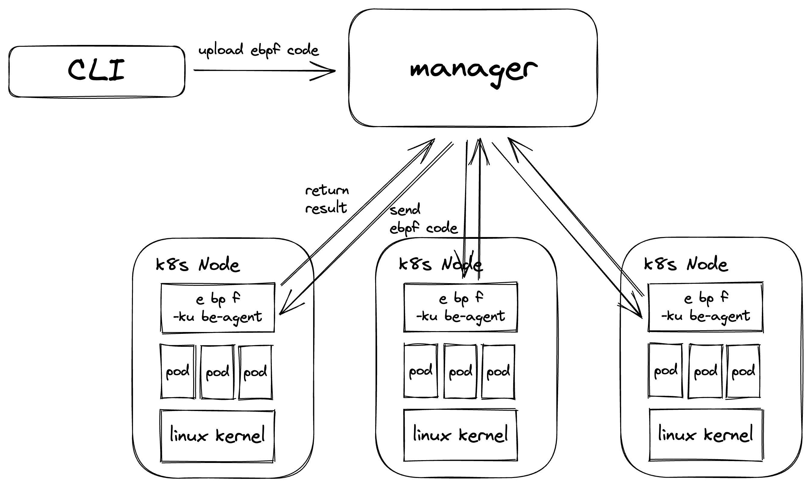

eBPF-Kube-Agent

# Overview
ebpf-kube-agent是一个以DaemonSet形式在kubernetes集群下的Node中维持一个容器来执行上传的ebpf代码的工具.提供了一个manager,用来对agents进行管理、下发ebpf代码和回收结果.客户端通过CLI的形式与集群中的manager进行交互.

# Design

`ebpf-kube-agent` 由三部分组成:
* CLI客户端: 通过CLI和在Kubernetes中运行的`manager` 进行交互, 支持通过CRD来定义执行
* Agent: 以DaemonSet的形式在通过`标签选择器`选中的pod上执行
* Manager: 管理agents,下发ebpf code到agent,回收执行结果

# Plan
- [X] 使用cilium/ebpf在Node上执行ebpf代码
- [X] 通过cli与pod进行交互
- [ ] 建立manager,cli不再和pod交互,改为通过manager管理

