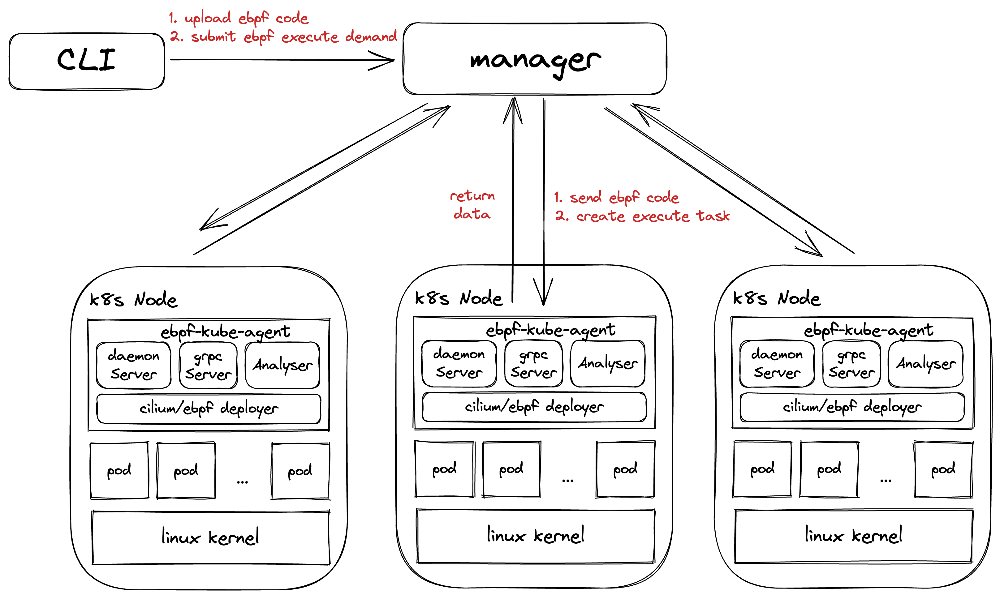
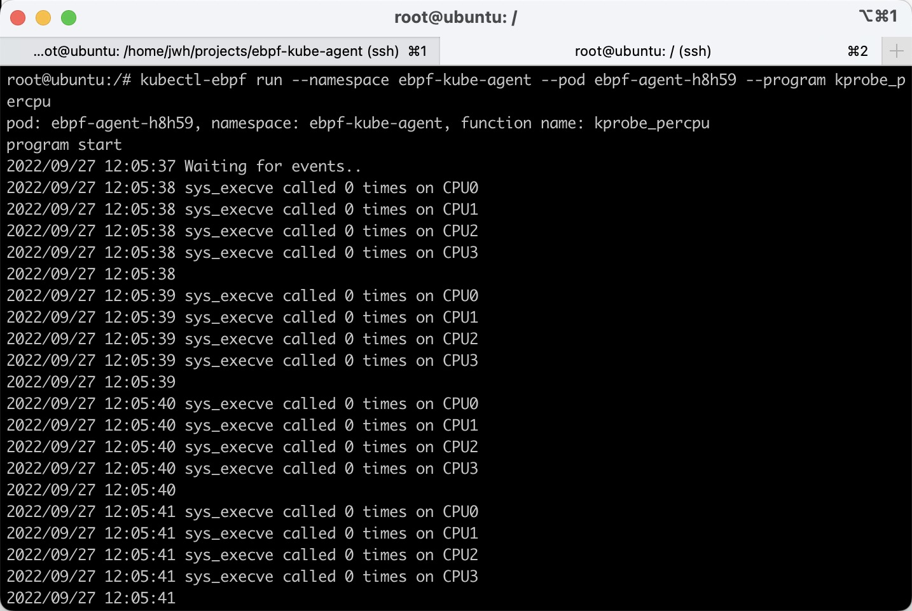

[WIP]eBPF-Kube-Agent
---
# Overview

`ebpf-kube-agent` 是一套利用[cilium/ebpf](https://github.com/cilium/ebpf)作为`ebpf program deployer`, 提供**快捷**、**高效**的在Kubernetes集群下的Node上部署ebpf program并获取data的**执行代理**.

提供了一个`manager`, 用来管理`agents`、 下发ebpf program和回收data. `client`通过CLI的形式与集群中的`manager`进行交互.

# Features


# Design



`ebpf-kube-agent` 由三部分组成:
* CLI客户端: 通过CLI和在Kubernetes中运行的`manager` 进行交互, 支持通过CRD来定义执行
* Agent: 以DaemonSet的形式在通过`标签选择器`选中的pod上执行
* Manager: 管理agents,下发ebpf code到agent,回收执行结果

# Road Map

- [X] 使用cilium/ebpf在Node上执行ebpf代码
- [X] 通过cli与pod进行交互
- [ ] 嵌入cilium/ebpf program generate
- [ ] 建立manager,cli不再和pod交互,改为通过manager管理
- [ ] 提高单测覆盖率
- [ ] 使用grpc进行通信

# Project Structure

```
|- bin // 可执行文件
|- cmd // 命令行
| |- agent // agent模块相关命令
|- doc // 文档
|- example 
|- images // docker镜像文件
| |- agent // agent模块相关镜像文件
|- k8s // k8s部署文件
| |- agent // agent模块相关部署文件
|- pkg // 源代码
| |- agent
| |- cmd
| |- ebpfjob // 暂时废弃
| |- log
| |- manager
|- Makefile // 构建相关命令
```

# Example

```sh
kubectl-ebpf run --namespace ebpf-kube-agent --pod ebpf-agent-h8h59 --program kprobe_percpu
```


## Requirements

- docker
- kind 
  - create a multi-node clusters
- make
- gcc
- git clone https://github.com/xujiajiadexiaokeai/ebpf-kube-agent.git

## Steps

```sh
// 二进制构建
1. cd ebpf-kube-agent
2. make build

// 镜像构建&部署
3. docker build -f /bin/ebpf-agent -t ebpf-agent:0.1 .
4. kind load docker-image ebpf-agent:0.1
5. kubectl create namespace ebpf-kube-agent
6. kubectl apply k8s/agent/agent-daemonset.yaml

// 加入PATH
7. cp /bin/kubectl-ebpf /usr/local/bin/

// 执行
8. kubectl-ebpf run --namespace ebpf-kube-agent --pod ebpf-agent-h8h59 --program kprobe_percpu
```